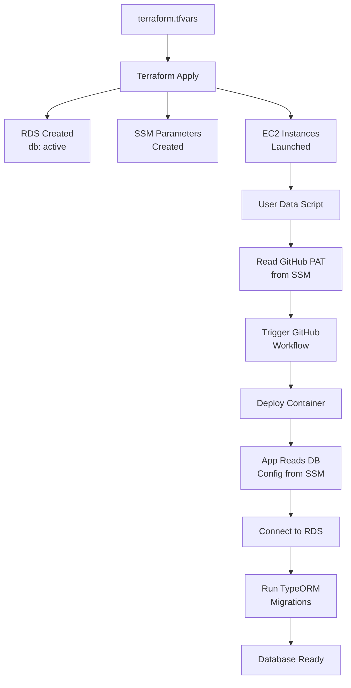

# YouWoAI Terraform Configuration Analysis

## How YouWoAI Handles Infrastructure Setup

### 1. Variables Required in terraform.tfvars

YouWoAI requires these variables (no defaults provided):

```hcl
# From YouWoAI variables.tf (required - no defaults):
db_username       # RDS master username
db_password       # RDS master password  
route53_zone_id   # For youwo.ai domain
redis_password    # Redis auth password
ghcr_pat         # GitHub Container Registry PAT
```

Variables with defaults:
```hcl
aws_region = "us-west-1"
custom_header_key = "pba8viT4zO/L0E6JFRU1pDZWqRhNP2SwwL5ZrEbg+go="
allowed_origins = "https://youwo.ai,https://www.youwo.ai,https://app.youwo.ai,http://localhost:8082"
```

### 2. Database Initialization Process

#### Step 1: Terraform Creates RDS
```hcl
# In server.tf
resource "aws_db_instance" "youwoai_postgres" {
  db_name = "active"  # Initial database name
  username = var.db_username
  password = var.db_password
  # ...
}
```

#### Step 2: Connection Info Stored in SSM
```hcl
# In aws_params.tf
resource "aws_ssm_parameter" "db_host" {
  name  = "/youwoai/prod/db_host"
  value = split(":", aws_db_instance.youwoai_postgres.endpoint)[0]
}

resource "aws_ssm_parameter" "db_password" {
  name  = "/youwoai/prod/db_password"
  type  = "SecureString"
  value = var.db_password
}
```

#### Step 3: Application Reads from SSM
The NestJS backend reads database credentials from SSM Parameter Store at startup, NOT from environment variables.

#### Step 4: TypeORM Migrations
```json
// package.json scripts
"makemigration": "npm run typeorm -- migration:generate",
"migrate": "npm run typeorm -- migration:run"
```

The database schema is managed by TypeORM migrations:
1. **First deployment**: Database is empty
2. **Application starts**: Reads connection from SSM
3. **Run migrations**: `pnpm run migrate` creates all tables
4. **Schema changes**: Generate new migrations with `pnpm run makemigration`

### 3. Key Differences from Traditional Setup

#### No Environment Variables for Secrets
- ❌ NOT using `.env` files for production secrets
- ✅ All secrets in SSM Parameter Store
- ✅ EC2 instances use IAM roles to read SSM

#### GitHub PAT Usage
```hcl
# Used in user_data script to trigger deployment
GITHUB_PAT=$(aws ssm get-parameter --name /youwoai/prod/ghcr_pat ...)

# Triggers GitHub workflow for deployment
curl -X POST https://api.github.com/repos/shonn-li/youwoai-ml-server/dispatches
```

**You're right** - For GitHub Actions, `GITHUB_TOKEN` is automatically provided. The PAT is used for:
1. EC2 instances to trigger workflows
2. Pulling from GitHub Container Registry (ghcr.io)

### 4. Complete Setup Flow



### 5. What Happens on First Launch

1. **Terraform creates**:
   - Empty RDS database named "active"
   - SSM parameters with connection info
   - EC2 instances with IAM roles

2. **EC2 User Data**:
   - Installs Docker
   - Gets GitHub PAT from SSM
   - Triggers deployment workflow

3. **Application Container**:
   - Pulls database config from SSM
   - Connects to empty database
   - TypeORM migrations create schema

4. **Manual Steps Required**:
   ```bash
   # SSH into instance or run via SSM
   docker exec -it youwoai-server bash
   pnpm run migrate  # Creates all tables
   ```

### 6. Secrets Storage Pattern

| Secret Type | Where Stored | How Accessed |
|------------|--------------|--------------|
| DB Password | terraform.tfvars → SSM | App reads from SSM |
| Redis Password | terraform.tfvars → SSM | App reads from SSM |
| API Keys (OpenAI, etc) | Manual SSM setup | App reads from SSM |
| GitHub PAT | terraform.tfvars → SSM | EC2 user-data reads |
| JWT Secret | Generated by app | Stored in SSM by app |

### 7. Why This Pattern?

**Advantages**:
- No secrets in code or env files
- Centralized secret management
- Audit trail via CloudTrail
- Easy rotation without redeploy
- IAM-based access control

**Considerations**:
- More complex initial setup
- Requires IAM roles properly configured
- SSM parameter limits (10,000 free tier)

### 8. Humansa Simplifications

For Humansa, you could simplify:

1. **Skip GitHub PAT** if not using ghcr.io
2. **Use simpler database name**: "humansa" instead of "active"
3. **Skip Redis password** if not using auth
4. **Direct container deployment** instead of GitHub workflow trigger

The core pattern remains:
- Terraform creates infrastructure
- Stores connection info in SSM
- Application reads from SSM
- Migrations handle schema